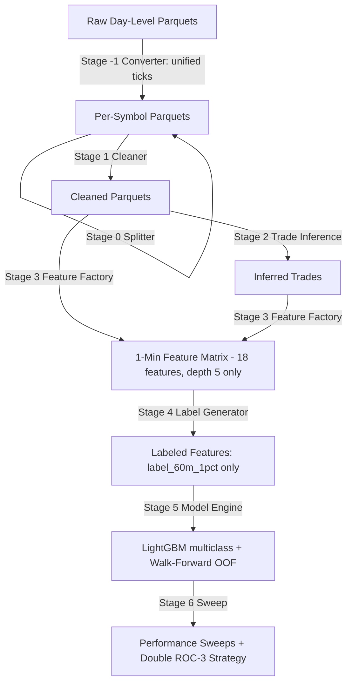

# Architecture Blueprint

## 1. Subsystems & Data Flow

## 2. Dependencies
- **Data Handler**: Pandas, PyArrow, NumPy, DuckDB (disk-based parquet processing)
- **ML Frameworks**: LightGBM multiclass (Random Forest / Logistic Regression retired)
- **Formatting & Storage**: Apache Parquet with Snappy compression
- **Logging & Infrastructure**: Standard Python `logging` and JSON experiment registry

## 3. Key Constraints
- **Timezone Boundary**: Raw timestamps are naive and localized to UTC in Stage 1. UTC re-enforced in alignment (`alignment.py`), feature factory (`feature_factory.py`), and DuckDB (`SET TIME ZONE 'UTC'` in `raw/data_cleaner.py`).
- **Memory Boundary**: DuckDB processes on-disk parquet; bursts RAM on read (not streaming per-worker). Do not assume <200 MB steady streaming.
- **Clock Sync Tolerance**: Tick-DOM nearest-neighbor event alignment uses ±1s tolerance (`utils/constants.py: ALIGNMENT_CONFIG tolerance_ms=1000`, `features/alignment.py: tolerance_s=1.0`). Unified feed (DOM columns already inside tick parquet) auto-skips alignment in `features/feature_factory.py`.
- **Stateless feature workers**: Feature computations must run isolation tests to prevent state leakage between symbol processing loops.
- **DOM Depth**: Raw parquets up to Jun 12 contain 20 levels; feature engine uses top 5 only (`imbalance_top5`, depth_drop on bqty1-5/aqty1-5). `imbalance_top10/top20` removed. Jun 15+ native depth 5 unified feed.
