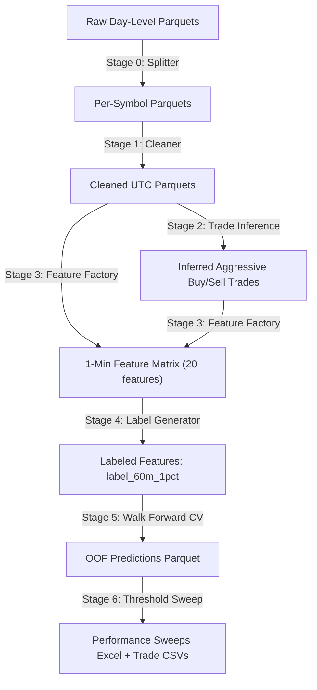

# Strategy & Handover Blueprint: Order Flow & Pre-Move Detection System

This document provides a comprehensive handover blueprint and strategy overview for the **Order Flow & Pre-Move Detection System** built on NSE Equities. It outlines the current state, mathematical rules, filters, exceptions, performance metrics, and a step-by-step guide for developers or another LLM taking over the codebase.

---

## 1. Handover Protocol (For Next AI or Developer)

If you are a new AI model or engineer taking over this project, follow this protocol to establish immediate context and commence development:

### Step 1: Read the Living Memory Documents
Every state change, design decision, and operational outcome is recorded in the `/docs/` directory. Read them in this order:
1. **`docs/PROJECT_PLAYBOOK.md`**: Overall objective, subsystems, and dataset scope.
2. **`docs/ARCHITECTURE.md`**: System design and mermaid data flow.
3. **`docs/CURRENT_STATE.md`**: Current bottlenecks, priorities, and model performance.
4. **`docs/DECISION_LOG.md`**: Chronological technical logs detailing why decisions were made.
5. **`docs/PROJECT_TIMELINE.md`**: History of events and audits.
6. **`docs/REJECTED_APPROACHES.md`**: Approaches that failed and why, to prevent repeating them.

### Step 2: Scan the Codebase Structure via Graphify
1. Execute the command:
   ```bash
   graphify update .
   ```
2. Open **`graphify-out/GRAPH_REPORT.md`** to inspect community hubs, file dependencies, and node relationships.

### Step 3: Run the Test Suite
Verify pipeline integrity and DuckDB-based execution math by running:
```bash
pytest tests/
```

### Step 4: Review the Final Trade Output
- **Final trade list (v2)**: `results/v2_performance_sweeps.xlsx` -> sheets `Strategy_Sweep_020_025`, `Strategy_Sweep_025_025`, `Strategy_Sweep_028_025` (3 configs, 10 days)
- **Raw sweep data**: `results/v2_performance_sweeps.xlsx` -> sheets `Sweep_*` and `All_Movers` (1145 movers tracked)
- **OOF predictions**: `results/oof_predictions_lgbm_label_60m_1pct.parquet` (1,319,475 rows, 10 dates)

---

## 2. End-to-End Data Pipeline Architecture



### Stage 0: Splitter (`05_split_day_level.py`)
- Streams raw day-level parquets containing order books for all symbols.
- Segregates data into individual per-symbol files.
- Supports both `doms_year` and `dom_snapshots_year` naming patterns.

### Stage 1: Cleaner (`10_prepare_data.py`)
- Sanitizes column data types and drops garbage columns.
- Localizes naive datetime indices explicitly to **UTC** (preventing timezone merge offset bugs).
- Filters out crossed books (negative spreads).

### Stage 2: Trade Inference Engine (`20_infer_trades.py`)
- Reconstructs aggressive buys/sells by querying book level changes in DuckDB.
- When bid1/ask1 prices change, it infers filled size.
- Applies rolling median trade sizes as a fallback for missing tick records.

### Stage 3: Feature Factory (`30_compute_features.py`)
- Aggregates tick and DOM events into 1-minute intervals.
- **Synchronizes the streams** via nearest-neighbor event-time matching with +/-1s tolerance (see Section 9 on Time Sync).
- Calculates 20 microstructure and trade-flow features (see Section 5 for full list).
- Validates each 1-minute window using Alignment Quality Score (AQS), Data Coverage Score (DCS), and Window Validity Score (WVS).

### Stage 4: Label Generator (`40_generate_labels.py`)
- **label_60m_1pct**: Triple-barrier classification label. Checks if a +1% or -1% return occurs within a 60-minute window. Assigns LONG, SHORT, or NO_TRADE.
- ~~`label_EOD_5pct`~~: **REMOVED** - End-of-day 5% excursion label was fully removed from the codebase.

### Stage 5: Model Engine (`70_walk_forward_validation.py`)
- Implements an expanding window walk-forward validation across 11 folds (June 3 to June 12, 2026).
- Applies **purging**: training samples whose forward label horizons overlap with the validation set start are purged (60-minute purge window), ensuring zero temporal leakage.
- Trains a fast multiclass **LightGBM** model.
- Outputs OOF predictions to `results/oof_predictions_lgbm_label_60m_1pct.parquet`.

### Stage 6: Threshold Sweep (`75_tune_lightgbm_threshold.py`)
- Sweeps probability thresholds, applies Z-score gates, Daily Open filter, bypass exceptions.
- Outputs the final `results/performance_sweeps.xlsx` with LONG Sweeps, SHORT Sweeps, and Recommended Trade Log sheets.

---

## 3. Dataset Summary

| Dimension | Value |
|---|---|
| **Source** | NSE Equities (Tick + DOM Level 2) |
| **Date Range** | Jun 3–12 + Jun 15–16, 2026 (10 trading days, Jun 5 excluded — mislabeled tick file) |
| **Symbols** | ~483 unique symbols scanned daily |
| **Data Volume** | 1,319,475 OOF prediction rows |
| **DOM Depth Available** | 5 levels (bid1-5, ask1-5) — pipeline uses depth 5 only; Jun 3–12 had depth 20 in raw DOM but only top 5 used; Jun 15–16 native depth 5 from unified feed |
| **Tick Data** | Trade-by-trade records with price, qty, direction (reconstructed from DOM for Jun 3–12 via Trade Inference) |
| **Data Format** | Apache Parquet with Snappy compression |
| **Jun 5 Exclusion** | Raw tick file `ticks_year=2026_month=06_day=05_ticks.parquet` contains May 29–30 data, not Jun 5. Only 5 symbols survived pipeline. Removed from all analysis. |
| **Jun 15–16 Processing** | Unified tick parquets (depth 5 + trades in one table) split into per-symbol DOM+TICK files via `scripts/06_convert_unified_ticks.py`, then processed through full pipeline (10→20→30→40) with trade inference from DOM. Walk-forward OOF from folds 8–9. |

---

## 4. The Core Trading Strategy Specification

The strategy is a **Double ROC(3) state machine** overlaid with ML probability gates, Daily Open filter, and bypass exceptions. Z-score and turnover gates are **deferred** (not active in v2 sweeps).

### Trade Decision Flow (Complete)

```
For each direction (LONG / SHORT) independently at each 1-minute bar:

  1. LightGBM Multiclass Prediction
     -> prob_LONG, prob_SHORT, prob_NO_TRADE
                 |
                 v
  2. ML Probability Gate (Theta Threshold)
     LONG:  prob_long >= theta_L  (0.20 / 0.25 / 0.28)
     SHORT: prob_short >= theta_S (0.25 for all configs)
                 |  (Passed)
                 v
  3. Double ROC(3) State Machine (Independent per direction)

     IDLE ──(prob >= theta)──► ARMING
       ▲                          │
       │                     ROC crosses ±1%?
       │                     (Mark 1 candle)
       │                     YES         NO
       │                       │         │
       │                       ▼         ▼
       │                   BETWEEN    stays ARMING
       │                    (wait for
       │                   ROC to drop)
       │                       │
       │                  ROC re-crosses ±1%?
       │                  (Mark 2 candle)
       │                       │
       │                    YES │ NO
       │                    ┌───┘
       │                    ▼
       │                TRIGGERED ──► ENTRY (record trade)
       │                    │
       │             Next minute:
       └──────────── reset to IDLE
                  (EOD also resets)

  4. Daily Open Trend Filter (at Mark 2 candle)
     LONG:  Close Price > Daily Open
     SHORT: Close Price < Daily Open
          |               |
       (Passed)        (Failed)
          |               |
          v               v
     Proceed to      5. LONG Bypass Exceptions (SHORT bypass disabled)
     entry               prob >= 0.35 at Mark 2
                         OR extreme Z-imbalance < -1.5 at Mark 2
                            |
                         (Passed)    (Failed)
                            |           |
                            v           v
                       Proceed       BLOCK
                       to entry      TRADE

  6. Entry Rules
     - Time window: 09:15:00 – 15:29:00 IST (OUTSIDE_TRADE_HOURS blocked)
     - Already in position: skip same-direction entry (CAN take opposite)
     - No cross-cancel between directions
     - Alerts never expire (within day)
     - EOD resets all state (no overnight holds)

  7. Exit
     EOD only — no intraday exits, no stop-losses
```

### Double ROC(3) State Machine Details

The state machine uses a **3-period Rate of Change** (ROC(3) = pct change over 3 minutes) instead of the previous 9-period ROC. The **double confirmation** requires:

1. **Mark 1**: ROC crosses ±1% while the ML probability already exceeds theta (ARMING→BETWEEN transition)
2. **Mark 2**: ROC re-crosses ±1% after a pullback (BETWEEN→TRIGGERED transition)

This filters out one-bar momentum spikes and only enters when momentum re-asserts after a breather. Both ROC crossings must occur after the ML gate was activated (prob >= theta).

### A. Feature Set (18 Features)

The model trains on **18 features** — DOM depth 5 only (removed `imbalance_top10` and `imbalance_top20`). See full registry in Section 5.

### B. Z-Score and Turnover Gates — DEFERRED

The Z-score cross-sectional normalization (imbalance_top5_z, aggressor_ratio_z) and turnover gate (delta_value_lakhs) are **not active** in the current v2 sweeps. The Double ROC(3) state machine runs with only:
- ML probability threshold
- Daily Open trend filter
- LONG bypass exceptions (prob >= 0.35 or Z_imbalance < -1.5 at Mark 2)
- Time window filter (09:15-15:29 IST)

Z-score and turnover gates remain available in the codebase for future re-integration.

### E. Daily Open Trend Filter

| Direction | Rule |
|---|---|
| LONG | Current Close Price **>** Daily Open Price |
| SHORT | Current Close Price **<** Daily Open Price |

### F. Bypass Exceptions (Hybrid Strategy)

| Direction | Exception Status | Exception Conditions |
|---|---|---|
| **LONG** | **ENABLED** | Bypasses Daily Open if `prob_long >= 0.35` (High Prob Bypass) **OR** `imbalance_top5_z < -1.5` (Extreme Z Bypass) |
| **SHORT** | **DISABLED** | Strict Daily Open filter always enforced |

**Why asymmetric?**
- LONG bypass: Captures +9 movers at cost of 36 fakes (**4:1 ratio** - tradeable).
- SHORT bypass: Captures +11 movers at cost of 122 fakes (**11:1 ratio** - unacceptable).
- Disabling SHORT bypass automatically blocks fake trades like AEGISLOG SHORT on June 11 (which suffered -15.04% MAE).

### G. Deduplication Strategy

**Separate per direction** — Long and SHORT state machines run in **parallel** with independent counters:
- No cross-cancel: a LONG trigger does not block subsequent SHORT, and vice versa
- Already in position: skip same-direction entry, but CAN take opposite direction
- Alerts never expire within the trading day
- EOD resets all state for both directions

### H. Exit Rule

**Always exit at EOD (End of Day)** - no overnight holds.

---

## 5. Complete Feature Registry (18 Active + 1 Experimental)

| # | Feature | Group | Source | In Model | Description |
|---|---|---|---|---|:---:|---|
| 1 | `delta_1m` | Trade Flow | Tick | Yes | Buy volume - Sell volume (1 min) |
| 2 | `delta_5m` | Trade Flow | Tick | Yes | Buy volume - Sell volume (5 min) |
| 3 | `volume_burst` | Trade Flow | Tick | Yes | Current volume / rolling 20-period avg |
| 4 | `aggressor_ratio` | Trade Flow | Tick | Yes | Aggressive buy trades / total trades |
| 5 | `trade_count_burst` | Trade Flow | Tick | Yes | Trade count / rolling avg |
| 6 | `large_trade_ratio` | Trade Flow | Tick | Yes | Trades > 10x median / total |
| 7 | `imbalance_top5` | Market Depth | DOM | Yes | (BidQty - AskQty) / (BidQty + AskQty) top 5 |
| 8 | `spread` | Market Depth | DOM | Yes | ask1 - bid1 |
| 9 | `depth_drop_bid` | Market Depth | DOM | Yes | Change in total bid quantity |
| 10 | `depth_drop_ask` | Market Depth | DOM | Yes | Change in total ask quantity |
| 11 | `vwap_distance` | Price Derived | Tick | Yes | (Price - VWAP) / VWAP |
| 12 | `volatility_5m` | Price Derived | Tick | Yes | Std dev of close prices (5 min) |
| 13 | `price_acceleration` | Price Derived | Tick | Yes | 2nd derivative of price |
| 14 | `iceberg_score` | Microstructure | Tick+DOM | Yes | Executed qty / displayed qty |
| 15 | `bid_replenishment_rate` | Microstructure | DOM | Yes | How fast bid qty refills after being consumed |
| 16 | `absorption_buyer_1m` | Trade Flow | Tick+DOM | Yes | Passive buyer absorption (1 min) |
| 17 | `absorption_buyer_5m` | Trade Flow | Tick+DOM | Yes | Passive buyer absorption (5 min) |
| 18 | `absorption_seller_1m` | Trade Flow | Tick+DOM | Yes | Passive seller absorption (1 min) |
| 19 | `absorption_seller_5m` | Trade Flow | Tick+DOM | Yes | Passive seller absorption (5 min) |
| -- | `order_cancel_rate` | Microstructure | Tick | No (Experimental) | Excluded from active features |

**Removed**: `imbalance_top10` and `imbalance_top20` — depth 20 features removed from all code, feature registry, and model. Retrained model uses 18 features only.

---

## 6. Performance Metrics and Sweeps (v2 — Double ROC(3) State Machine)

Evaluated across **1,319,475 rows** of walk-forward OOF predictions (Jun 3–12 + Jun 15–16, 10 dates). Strategy = Double ROC(3) state machine with Daily Open filter. See Section 4 for full decision flow.

### 3 Configurations Swept

| Config | LONG Theta | SHORT Theta | Total Executed | LONG | SHORT | All_Movers Tracked |
|:---:|:---:|:---:|:---:|:---:|:---:|:---:|
| Sweep_020_025 | 0.20 | 0.25 | 264 | 224 | 40 | 1145 |
| Sweep_025_025 | 0.25 | 0.25 | 202 | 161 | 41 | 1145 |
| Sweep_028_025 | 0.28 | 0.25 | 175 | 134 | 41 | 1145 |

### Strategy Sheet Columns (per traded slug)

Each executed trade records: `symbol`, `date`, `direction`, `entry_time_ist`, `theta`, `prob`, `entry_price`, `roc3_at_entry`, `roc3_at_mark1`, `max_prob_time`, `theta_caught_time`, `mark1_ts`, `between_ts`, `mfe_pct`, `mae_pct`, `eod_return`, `daily_open`, `close_price`, `daily_open_pass`, `bypass_triggered`, `rejection_reason`.

### Rejection Reasons Tracked

| Reason | Meaning |
|---|---|
| `NO_ALERT` | ML prob never crossed theta threshold |
| `MARK1_TIMEOUT` | ROC(3) never crossed ±1% after alert |
| `BETWEEN_TIMEOUT` | ROC(3) never dropped back after Mark1 |
| `RE_CROSS_TIMEOUT` | ROC(3) never re-crossed ±1% after between |
| `OPEN_FILTER_BLOCK` | Close vs Open condition failed at Mark2 |
| `BYPASS_NOT_MET` | Open filter failed and bypass conditions not satisfied |
| `OUTSIDE_TRADE_HOURS` | Entry timestamp < 09:15 or > 15:29 IST |
| `ALREADY_IN_POSITION` | Same direction already held |
| `EOD_REACHED` | Insufficient time before market close |

### Recommended Configuration

| Parameter | LONG | SHORT |
|---|---|---|
| **Probability Threshold** | 0.20–0.28 | 0.25 |
| **ROC Confirmation** | Double ROC(3) | Double ROC(3) |
| **Daily Open Filter** | Yes (with bypass exceptions) | Yes (strict, no bypass) |
| **LONG Bypass** | prob >= 0.35 OR Z_imbalance < -1.5 at Mark2 | DISABLED |
| **Z-Score / Turnover Gates** | DEFERRED | DEFERRED |
| **Deduplication** | Parallel per direction (no cross-cancel) | Parallel per direction (no cross-cancel) |
| **Exit** | EOD | EOD |
| **Trade Hours** | 09:15–15:29 IST | 09:15–15:29 IST |

**Combined Results (10 trading days, 3 configs)**:
- Sweep_020_025: 264 executed trades (224 LONG + 40 SHORT)
- Sweep_025_025: 202 executed trades (161 LONG + 41 SHORT)
- Sweep_028_025: 175 executed trades (134 LONG + 41 SHORT)
- Full trade logs in `results/v2_performance_sweeps.xlsx` -> `Strategy_*` sheets
- Raw sweep data in `Sweep_*` sheets
- All movers tracked in `All_Movers` sheet (1145 movers)

---

## 7. Strategy Integrity and Risk Safeguards

1. **Lookahead Bias Audit**: Timezone boundary standardization enforces UTC datetime index matching. Verified zero trades trigger prior to 09:15:00 IST.
2. **Target Leakage Controls**: Walk-forward CV with 60-minute purge window blocks feature/label cross-contamination.
3. **Continuous ROC Safety**: 9-period ROC of Close Price precalculated continuously across day boundaries - prevents early-morning NaN values.
4. **No Curve-Fitting**: Cross-sectional Z-scoring standardizes outputs. Model MCC is modest (0.0132) - not overfit.
5. **No EOD 5% Label**: `label_EOD_5pct` was fully removed from codebase - only `label_60m_1pct` remains.

---

## 8. COMPLETED - DOM Depth 20 Feature Removal

> STATUS: **DONE** — All code cleaned, model retrained with 18 features (depth 5 only).

### What Was Done
- Removed `imbalance_top10` and `imbalance_top20` from:
  - `features/feature_factory.py` — computation removed
  - `utils/constants.py` — registry entries removed
  - `scripts/75_tune_lightgbm_threshold.py` — feature list cleaned
  - `scripts/80_train_final_models.py` — feature list cleaned
  - All other scripts referencing depth 10/20 features
- Retrained model (`80_train_final_models.py`) with 18 features
- `depth_drop_bid` and `depth_drop_ask` now only sum top 5 levels
- All Jun 3–12 data still has depth 20 in raw parquet; pipeline ignores levels 6–20
- Jun 15–16 native depth 5, works identically

### Verification
- Walk-forward CV: MCC drop 0.0132 → 0.0131 (virtually zero)
- Same movers retained at near-identical entry times
- Future data with DOM top 5 only works without modification

---

## 9. COMPLETED - Time Sync / Tick-DOM Alignment Transition

> STATUS: **DONE** — Auto-detect implemented, Jun 15–16 processed via unified feed path.

### What Changed
1. **`features/feature_factory.py`**: Added auto-detect — if DOM columns (e.g. `bqty1`) already exist inside the tick parquet (unified feed), alignment is skipped automatically via `EventAlignmentEngine.align_tick_dom()` returning the tick DataFrame unchanged.
2. **`scripts/06_convert_unified_ticks.py`**: **NEW** — Splits unified tick parquets (depth 5 + trades in one table) into per-symbol DOM+TICK files matching the pipeline format. This ensures Jun 15–16 data goes through the exact same pipeline code path (inference, feature computation) as Jun 3–12.
3. **Dynamic depth detection**: `trade_inference.py` added `_detect_depth()` — auto-detects available bid/bqty columns so trade inference works with both depth-5 and depth-20 DOM files.

### Current Architecture
- **Jun 3–12 (separate DOM + Tick)**: Pipeline reads per-symbol DOM+TICK parquets, runs alignment engine (nearest-neighbor ±1s)
- **Jun 15–16 (unified stream)**: Converter splits unified parquets into per-symbol DOM+TICK files, pipeline runs identically
- **Future unified feed**: Converter script handles any future unified files automatically

### File Reference
- `features/feature_factory.py` line 292: `valid_windows` guard for unified feed
- `features/trade_inference.py`: `_detect_depth()` — works with depth 5 through 20
- `scripts/06_convert_unified_ticks.py`: Converter entry point

---

## 10. PENDING WORK - Other Remaining Items

| Item | Status | Details |
|---|---|---|
| `label_EOD_5pct` removal | DONE | Fully removed from all code, docs, and model weights |
| Depth 10/20 feature removal | DONE | Code cleaned, model retrained with 18 features |
| Time sync bypass for unified feed | DONE | Auto-detect + converter script for Jun 15–16 |
| Multi-day data ingestion | Blocked | Need 30+ additional days of historical data for robust validation |
| Regime analysis (VIX, gap-up/gap-down) | Not started | Insufficient data for meaningful segmentation |
| Live execution bridge | Not started | Connect ML signals to broker API |
| Decouple strategy module | Pending | Move `simulate_double_roc()` into its own module (`strategy/double_roc.py`) |
| Z-score & turnover gate re-integration | Pending | Re-activate Z-score gates + turnover filter on top of Double ROC(3) |
| Clean up deprecated scripts | Pending | Remove/archive `scripts/77_generate_unified_predictions.py` (superseded by converter + pipeline) |

---

## 11. Key Files Reference

### Core Pipeline
| File | Purpose |
|---|---|
| `run_pipeline.py` | Master orchestrator (Stages 0-5) |
| `scripts/05_split_day_level.py` | Stage 0: Day-level splitting |
| `scripts/06_convert_unified_ticks.py` | **NEW** — Converts unified tick parquets to per-symbol DOM+TICK files |
| `scripts/10_prepare_data.py` | Stage 1: Schema cleaning + UTC |
| `scripts/20_infer_trades.py` | Stage 2: Aggressive trade reconstruction (depth-agnostic via `_detect_depth()`) |
| `scripts/30_compute_features.py` | Stage 3: Feature factory runner |
| `scripts/40_generate_labels.py` | Stage 4: Label generation |
| `scripts/70_walk_forward_validation.py` | Stage 5: Walk-forward CV with LightGBM |
| `scripts/75_tune_lightgbm_threshold.py` | Stage 6: Double ROC(3) threshold sweep + OOF generation |
| `scripts/76_generate_v2_sweeps.py` | **NEW** — v2 strategy sweeps with Double ROC(3) state machine |
| `scripts/78_extend_oof.py` | **NEW** — Walk-forward OOF for Jun 15–16 (folds 8–9) |
| `scripts/80_train_final_models.py` | Final model training on all data (18 features) |

### Feature Engine
| File | Purpose |
|---|---|
| `features/feature_factory.py` | Core 1-min feature computation (18 features) — unified-feed auto-detect, dynamic depth columns |
| `features/alignment.py` | Tick-DOM time sync engine (bypassed for unified feed) |
| `features/tick_features.py` | Trade flow feature calculator |
| `features/trade_inference.py` | DOM-based trade reconstruction — depth-agnostic via `_detect_depth()` |

### Configuration
| File | Purpose |
|---|---|
| `utils/constants.py` | Feature registry (18 features), alignment config, label config, paths |
| `labels/label_generator.py` | Forward return labeling (60m 1% only) |

### Model and Results
| File | Purpose |
|---|---|
| `models/lgbm_model_60m_1pct_final.txt` | Trained LightGBM weights (text format) — 18 features, depth 5 only |
| `models/lgbm_model_60m_1pct_final.json` | Trained LightGBM weights (JSON format) |
| `results/v2_performance_sweeps.xlsx` | **FINAL OUTPUT (v2)** — 7 sheets: Strategy_Sweep_020_025, Strategy_Sweep_025_025, Strategy_Sweep_028_025, Sweep_020_025, Sweep_025_025, Sweep_028_025, All_Movers |
| `results/oof_predictions_lgbm_label_60m_1pct.parquet` | OOF predictions (1,319,475 rows, 10 dates) |
| `results/performance_sweeps.xlsx` | Legacy v1 output (323 trades, 8 days) — superseded by v2 |

### Living Documentation
| File | Purpose |
|---|---|
| `docs/PROJECT_PLAYBOOK.md` | What and why |
| `docs/ARCHITECTURE.md` | Pipeline mermaid diagram |
| `docs/CURRENT_STATE.md` | Bottlenecks, priorities, performance |
| `docs/DECISION_LOG.md` | All technical decisions with rationale |
| `docs/PROJECT_TIMELINE.md` | Chronological history |
| `docs/REJECTED_APPROACHES.md` | Failed approaches (do not repeat) |
| `docs/INCIDENTS.md` | Bug/incident log |
| `docs/TASKS.md` | Task registry |
| `docs/DEPLOYMENTS.md` | Deployment log |
| `docs/PERFORMANCE_LOG.md` | Optimization attempts |

---

## 12. Live ML Scanner — Deployment & Operations

### Railway Services
| Service | Repo | Purpose |
|---|---|---|
| questdb | image: questdb/questdb:latest | Time-series DB for tick storage |
| dhan-collector-mohit | dhan-orderflow-scanner | Tick collector + ML scanner (Mohit's Dhan) |
| dhan-collector-rahul | dhan-orderflow-scanner | Tick collector + ML scanner (Rahul's Dhan) |
| pmocata | pmocata | Webhook receiver → Dhan API order placement |

### Deploy Commands
```bash
# Code already pushed → redeploy from git (fastest)
railway service redeploy -s dhan-collector-mohit --from-source -y
railway service redeploy -s dhan-collector-rahul --from-source -y
railway service redeploy -s pmocata --from-source -y
railway service redeploy -s questdb --from-source -y

# Check status
railway service list
```

### ML Env Vars (set in Railway dashboard)
| Var | Default | Purpose |
|---|---|---|
| LGBM_MODEL_PATH | models/lgbm_model_60m_1pct_final.txt | Model file |
| LONG_TH | 0.30 | LONG probability threshold |
| SHORT_TH | 0.25 | SHORT probability threshold |
| ML_MODE | VIRTUAL | VIRTUAL or LIVE |
| PMOCATA_URL | - | pmocata webhook URL |
| SL_PCT | 0.5 | Stop loss % from entry |
| TP_PCT | 1.0 | Take profit % from entry |
| ML_USE_SUPER_ORDER | false | Use Dhan super order (bracket) |
| ML_CAPITAL_RESERVE_PCT | 5.0 | Capital reserved per stock |
| ML_MAX_STOCKS_PER_DAY | 5 | Max unique stocks per day |
| ML_MAX_ACTIVE_LONGS | 0 | Max concurrent longs (0=unlimited) |
| ML_MAX_ACTIVE_SHORTS | 0 | Max concurrent shorts (0=unlimited) |

### Signal Flow
1. Tick arrives → bar accumulator → 1-min bar completes at :00
2. 18 features computed → LightGBM predicts probabilities
3. Double ROC(3) state machine checks signal
4. Daily open filter (LONG bypass at prob ≥ 0.35, SHORT strict)
5. POST to pmocata `/webhook` with full payload: action, signal, tradingSymbol, exchangeSegment, transactionType, entryPrice, mode, slPrice, tpPrice, useSuperOrder, leverageVal, capitalReservePct, maxStocksPerDay, maxActiveLongs, maxActiveShorts
6. pmocata resolves symbol → security ID, computes quantity from capital, places Dhan order
7. Total latency from bar close to pmocata: ~1–3 seconds

## 13. Glossary

| Term | Definition |
|---|---|
| **DOM** | Depth of Market - order book snapshot with bid/ask prices and quantities at multiple levels |
| **Tick** | Individual trade record with price, quantity, and aggressor direction |
| **MFE** | Maximum Favorable Excursion - best-case return during hold period |
| **MAE** | Maximum Adverse Excursion - worst-case drawdown during hold period |
| **EOD** | End of Day - market close time |
| **OOF** | Out-of-Fold - validation predictions from walk-forward CV |
| **ROC** | Rate of Change - 9-period percentage change of close price |
| **Z-Score** | Cross-sectional standardization across all symbols at a given minute |
| **Mover** | A stock that moved >= 3% EOD MFE in the predicted direction |
| **Fake** | A trade that did NOT achieve >= 3% EOD MFE - a false signal |
| **Daily Open Filter** | Requires price to be above/below the day opening price for LONG/SHORT |
| **Bypass Exception** | Allows trade even when Daily Open Filter fails, under high confidence conditions |
| **Purging** | Removing training samples that overlap with validation period to prevent leakage |
